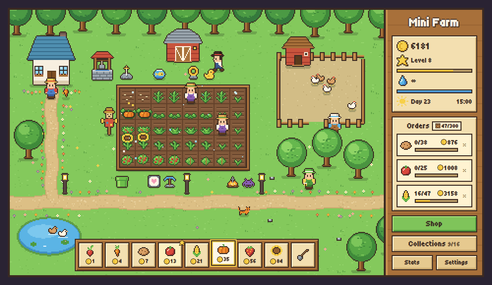
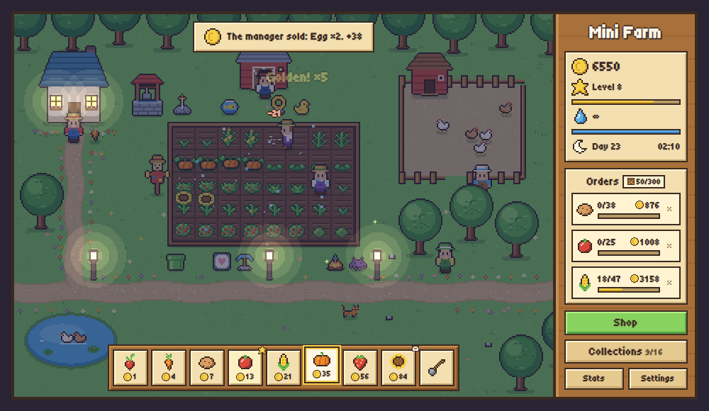
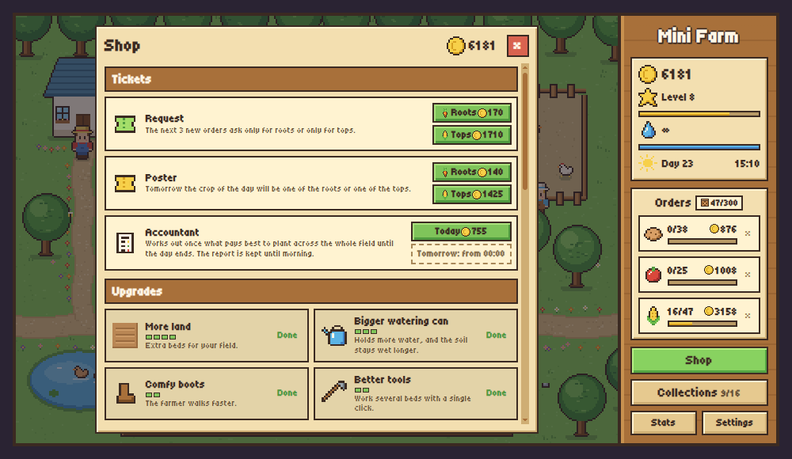
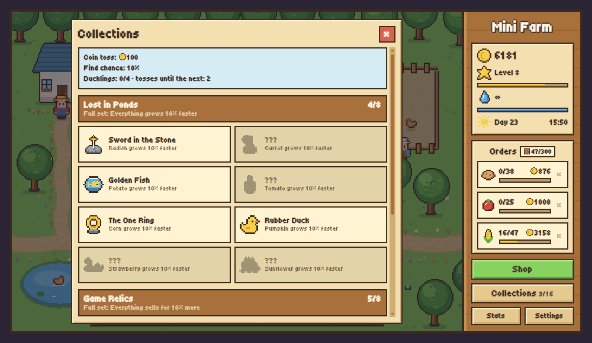

# 🌱 Mini Farm

A small, cozy pixel-art farming game that lives in your browser. Dig a bed, plant a radish, water it, and before you know it you are running a farm with chickens, apple trees, hired hands and a cat that does almost nothing useful.

**[▶ Play it now on GitHub Pages](https://dalidovich.github.io/minifarm/)**

No install, no sign-up, mouse only. Your progress is saved automatically in the browser.

[](https://dalidovich.github.io/minifarm/)

## What you do here

- **Grow things.** Eight crops from radishes to sunflowers, each one slower and more valuable than the last.
- **Fill orders.** Neighbours ask for goods and pay well for them. Every day one crop is the crop of the day and sells for extra.
- **Build up the farm.** More land, a bigger watering can, a barn to store the harvest, sprinklers, a renovated house.
- **Keep animals.** Chickens lay eggs, apple trees bear fruit again and again.
- **Hire help.** Field hands work their own plots, helpers gather eggs and apples, and a manager sells from the barn following the policy you set.
- **Enjoy the little things.** Bees double a harvest, fireflies gather around the lanterns at night, the scarecrow loses his hat before rain, and ducks dive into the pond for relics.

## A look around

| Night on the farm | The shop |
| --- | --- |
|  |  |

| Collections |
| --- |
|  |

## How to play

1. Click a patch of grass inside the frame to dig a bed.
2. Pick seeds in the bar at the bottom and click the bed to plant them.
3. Click the seeds to water them. Refill the watering can at the well.
4. When the crop is ripe, click it to harvest.
5. Spend the coins in the shop and watch the farm grow.

Tip: hold the mouse button and drag across the beds, and the farmer will work them one by one.

The game is available in English and Russian. You can switch the language, sounds and music in the settings.

## Run it locally

There is no build step and there are no dependencies. Clone the repository and open `index.html` in a desktop browser:

```
git clone https://github.com/Dalidovich/minifarm.git
```

## For the curious

Everything is plain HTML, CSS and JavaScript. The pixel art is generated at startup and the sounds are synthesized, so there are no image or audio files in the game at all.

```
index.html          page skeleton and script order
css/style.css       interface styling
fonts/              Tiny5 pixel font (SIL OFL, see fonts/OFL.txt)
js/config.js        all balance numbers and world layout
js/i18n.js          tiny localization helper
js/locales/         interface texts (en, ru)
js/sprites.js       pixel art, generated at startup
js/audio.js         synthesized sounds and music
js/game.js          game state, rules, saving
js/render.js        canvas drawing
js/ui.js            sidebar, seed bar, shop, input
js/main.js          startup and main loop
```

### Adding a language

Copy `js/locales/en.js`, translate the values, register it under a new key in `MF.locales` and add a `<script>` tag for it in `index.html`. It will show up in the settings automatically.
